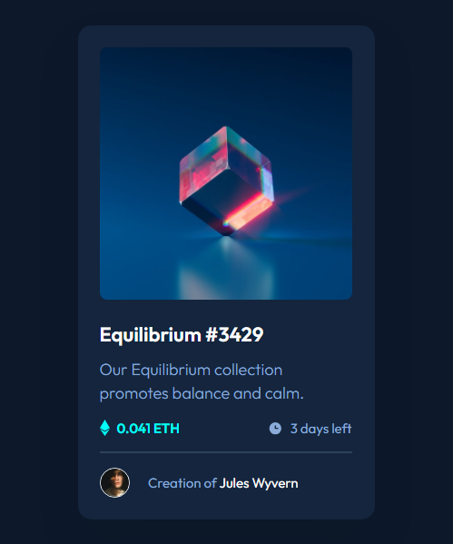
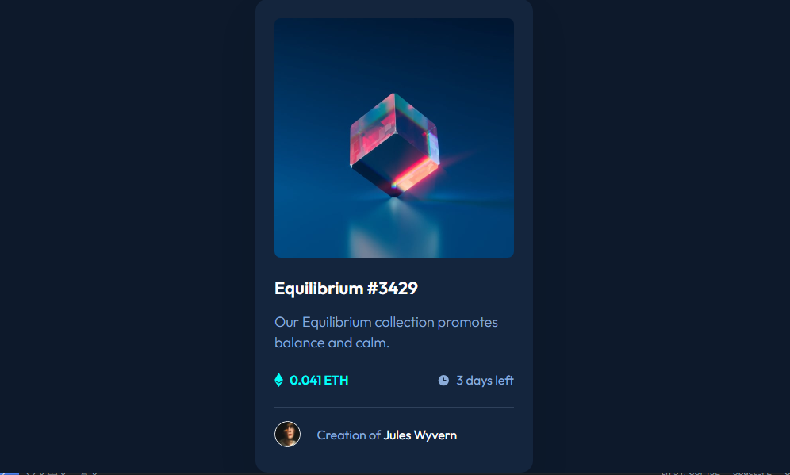
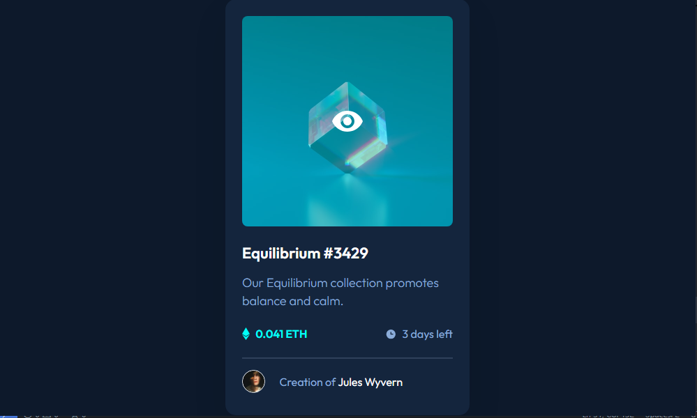

# Frontend Mentor - NFT preview card component solution

This is a solution to the [NFT preview card component challenge on Frontend Mentor](https://www.frontendmentor.io/challenges/nft-preview-card-component-SbdUL_w0U). Frontend Mentor challenges help you improve your coding skills by building realistic projects.

## Table of contents

- [Overview](#overview)
  - [The challenge](#the-challenge)
  - [Screenshot](#screenshot)
  - [Links](#links)
- [My process](#my-process)
  - [Built with](#built-with)
  - [What I learned](#what-i-learned)
- [Author](#author)

## Overview

### The challenge

Users should be able to:

- View the optimal layout depending on their device's screen size
- See hover states for interactive elements

### Screenshot

### Links

- Solution URL: [Frontend Mentor Solution](https://www.frontendmentor.io/solutions/responsive-nft-preview-card-component-dOJz7cucEE)
- Live Site URL: [Live Site](https://nelson-j-montesinos.github.io/NFT-Preview-Card-Component/)

## My process

### Built with

- Semantic HTML5 markup
- CSS custom properties
- Flexbox
- Mobile-first workflow

### What I learned

In the course of this project, I developed proficiency with the CSS position property to precisely control the placement of elements within the page layout. Additionally, I gained experience with the opacity property, leveraging it to adjust element visibility effectively within the user interface.

## Author

- LinkedIn - [@NelsonMontesinos](www.linkedin.com/in/njmontesinos)
- Frontend Mentor - [@Daydream-Softworks](https://www.frontendmentor.io/profile/Daydream-Softworks)
